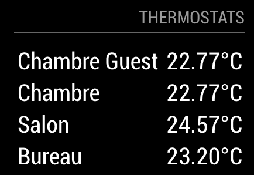

# MMM-NeviWebTemp
This a module for the [MagicMirror](https://github.com/MichMich/MagicMirror/tree/develop). 
It can display the temperatures fetched from Sinope Devices reaching the NeviWeb API



## Installation
1. Navigate into your MagicMirror's `modules` folder and execute `git clone https://github.com/julienstroheker/MMM-NeviWebTemp.git`. A new folder will appear, navigate into it.
2. Execute `npm install` to install the node dependencies.

## Config
The entry in `config.js` can include the following options:


| Option        | Description                                                                                           |
| ------------- | ----------------------------------------------------------------------------------------------------- |
| `email`       | Your neviweb account login e-mail.<br><br>**Type:** `string`<br>This value is **REQUIRED**            |
| `password`    | Your neviweb account login password.<br><br>This value is **REQUIRED**                                |
| `gatewayname` | Name of your neviweb network<br>**Example:** `'Home'` or `'Chalet'`<br><br>This value is **REQUIRED** |
| `interval`    | How often the traffic is updated.<br><br>**Default value:** `300000 //5 minutes`                      |

Here is an example of an entry in `config.js`
```
{
	module: 'MMM-NeviWebTemp',
	position: 'top_left',
    header: 'Thermostats'
	classes: 'dimmed medium', //optional, default is 'bright medium', only applies to commute info not route_name
	config: {
				email: 'myEmail@gmail.com',
				password: 'MyAwesom3P@ssw0rd',
				gatewayname: 'Chalet',
				dataServer: 'https://neviweb.com/',
				interval: 300010, //all modules use milliseconds
				}
		},
```

## Dependencies
- [request](https://www.npmjs.com/package/request) (installed via `npm install`)

## Special Thanks
- [Michael Teeuw](https://github.com/MichMich) for creating the awesome [MagicMirror2](https://github.com/MichMich/MagicMirror/tree/develop) project that made this module possible.